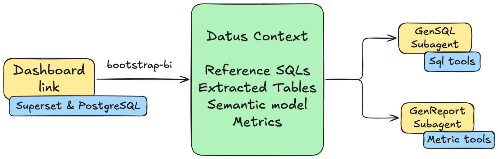

# Turn a Dashboard into a Copilot

Transform a Superset dashboard into two AI subagents: a main subagent for self-service SQL and an attribution subagent for metric comparison and root-cause analysis.

This tutorial walks through the complete flow with the Superset plugin, the generic `dashboard-bootstrap` skill, and the Dosi semantic adapter. Dashboard discovery and SQL export belong to the plugin; the skill coordinates user selection and routes exported SQL to Datus's builtin context-building agents.

!!! info "What this tutorial starts from"
    This guide starts with an existing Superset dashboard. To build a data pipeline and create a new dashboard instead, follow [End-to-End Data Engineering](data_engineering_quickstart.md). If this is your first time using Datus, complete [Install and First Query](Quickstart.md) first.

## Why Dashboard Copilot?

Traditional BI dashboards are static: they show predefined charts and metrics, but users cannot ask follow-up questions or explore data beyond what has been pre-built. Dashboard Copilot turns the dashboard into analysis agents that can:

- answer ad-hoc questions using the same tables and SQL evidence as the dashboard;
- generate SQL constrained to the dashboard's Knowledge Base scope;
- compare metrics across periods and dimensions;
- provide attribution analysis for metric changes.

The bootstrap process builds reference SQL and semantic metrics first, then creates two scoped subagents:

- **Main subagent**: self-service SQL over the dashboard's tables, metrics, and reference SQL.
- **Attribution subagent**: metric comparison, dimension-level attribution, and root-cause analysis.



## Prerequisites

Before starting, install:

- Docker Desktop or Docker Engine with Docker Compose;
- Python 3.12 and Datus;
- Git, `curl`, and `unzip`.

The commands below use `~/datus-dashboard-copilot-demo` as the working directory. They deploy the pinned Superset example stack used by this tutorial and keep generated SQL and semantic assets in that directory.

## Step 1: Deploy Superset and PostgreSQL

Download the local Superset stack:

```bash
mkdir -p ~/datus-dashboard-copilot-demo
cd ~/datus-dashboard-copilot-demo

curl -L -o datus-dashboard-copilot-stack-v1.zip \
  https://github.com/Datus-ai/datus-quickstart-data/releases/download/data-engineering-v1/datus-dashboard-copilot-stack-v1.zip

unzip -jo datus-dashboard-copilot-stack-v1.zip \
  '*/superset/docker-compose.yml' \
  '*/superset/superset_config.py'
```

The Superset example database identifies PostgreSQL as `postgres:5432/superset_examples`. `dashboard-bootstrap` matches this connection identity to a configured Datus datasource. For this host-side demo, expose the same port and make the Compose service name resolvable from the host:

```bash
cat > docker-compose.override.yml <<'YAML'
services:
  postgres:
    ports:
      - "5432:5432"
YAML

grep -qE '(^|[[:space:]])postgres([[:space:]]|$)' /etc/hosts || \
  echo '127.0.0.1 postgres' | sudo tee -a /etc/hosts
```

!!! note "Connection identity"
    The `postgres` host alias is only for this local demo. In a real deployment, configure Datus with the actual endpoint already used by the Superset Database connection. Backend, endpoint, and physical database/catalog must produce one unique Datus datasource match. A matching table or schema name alone is intentionally insufficient.

Start the services:

```bash
docker compose up -d
docker compose ps
docker compose logs -f superset
```

Stop following the logs after Superset is ready. The local services are:

- Superset: [http://localhost:8088](http://localhost:8088), username/password `admin/admin`;
- PostgreSQL: `postgres:5432`, database `superset_examples`, username/password `superset/superset`.

Open Superset and confirm that the example **World Bank's Data** dashboard is available.

## Step 2: Install the Superset plugin and Dosi adapter

Install the Superset plugin from the Datus Plugins Git repository:

```bash
datus plugin install "git:https://github.com/Datus-ai/Datus-Plugins.git#subdirectory=datus-superset-plugin"
datus plugin info superset
```

To update an existing Git installation, run `datus plugin upgrade superset`.

Install the Dosi semantic adapter into the same Python environment as Datus:

```bash
python -m pip install datus-semantic-dosi
```

When developing all components from source, follow the editable-install commands in [Dosi Semantic Adapter](../adapters/dosi_semantic_adapter.md#install) instead.

## Step 3: Configure the demo project

### Set demo credentials as environment variables

The demo stack uses public local-only credentials. Keep them out of `agent.yml` nevertheless:

```bash
export SUPERSET_PASSWORD=admin
export SUPERSET_PG_PASSWORD=superset
```

Run Datus from a shell where these variables remain exported.

### Update `agent.yml`

Merge the following entries into the existing `agent:` section in `~/.datus/conf/agent.yml`. Preserve your existing model provider configuration.

```yaml
agent:
  services:
    datasources:
      superset-pg:
        type: postgresql
        host: postgres
        port: 5432
        username: superset
        password: ${SUPERSET_PG_PASSWORD}
        database: superset_examples
        schema: public

    semantic_layer:
      dosi:
        type: dosi
        default: true

  plugins:
    superset:
      local:
        default: true
        api_base_url: http://localhost:8088
        auth_mode: login
        username: admin
        password: ${SUPERSET_PASSWORD}
        provider: db
        verify_ssl: "true"
        timeout: "30"
```

The launch command below selects `superset-pg` explicitly. If your existing configuration contains another semantic adapter marked `default: true`, clear that flag before making Dosi the default for this demo.

The Superset plugin returns the credential-free source identity of every selected query, and `dashboard-bootstrap` resolves each identity independently against the configured Datus datasources. This allows one Dashboard to contain queries from multiple physical databases.

!!! tip "Configure the profile with the plugin skill"
    Instead of editing the plugin section manually, start Datus and ask: `Configure the Superset plugin profile local for http://localhost:8088 using login auth and the SUPERSET_PASSWORD environment variable.` The plugin's `superset-setup` skill writes only an environment-variable reference, never the literal password.

### Enable and verify the plugin

Enable the plugin and profile for this project:

```bash
cd ~/datus-dashboard-copilot-demo
datus plugin enable superset --profile local
```

Verify both authentication and dashboard discovery before starting the LLM workflow:

```bash
datus superset --profile local status health
datus superset --profile local dashboards list
```

You should see **World Bank's Data** in the dashboard list. The plugin is now ready to provide `superset-query-export` to the agent.

## Step 4: Bootstrap the World Bank dashboard

### Launch Datus and select a model

Always launch Datus from the demo directory so exported SQL, Knowledge Base artifacts, semantic models, and project configuration are written there:

```bash
cd ~/datus-dashboard-copilot-demo
datus --datasource superset-pg
```

Select an LLM provider and model:

```text
> /model
```

See [Model Command](../cli/other_commands.md#model) for provider configuration.

### Start the skill-driven workflow

Send one natural-language request:

```text
Use the Superset plugin with profile local and follow the dashboard-bootstrap skill to bootstrap the World Bank's Data dashboard. Select all exportable dashboard queries for reference SQL and metric evidence. Show me the Generation Manifest and wait for confirmation before writing anything.
```

You can also start the same workflow with the slash command:

```text
> /bootstrap-bi use Superset profile local and the World Bank's Data dashboard; select all exportable queries for reference SQL and metrics
```

Both forms run the same `dashboard-bootstrap` workflow.

### What the agent does before confirmation

The main agent loads two skills:

1. `dashboard-bootstrap`, which owns the generic workflow;
2. `superset-query-export`, which documents the Superset discovery and export commands.

It then uses the plugin to:

```bash
datus superset --profile local dashboards list
datus superset --profile local context candidates <dashboard-id>
```

`context candidates` is read-only. It returns stable candidate IDs, Chart names, exportability, and a credential-free source identity resolved through each Chart's real Superset Dataset and Database connection.

For this stack, the World Bank queries should resolve to:

```text
backend: postgresql
host: postgres
port: 5432
database: superset_examples
dataset: public.wb_health_population
matched Datus datasource: superset-pg
```

The agent asks separately which queries should become reference SQL and which should provide metric evidence. This tutorial selects all exportable queries for both sets. Aggregation is a recommendation signal; the metric selection remains explicit.

### Review the Generation Manifest

Before exporting any SQL, the agent prints a Generation Manifest similar to:

```text
Generation Manifest

Plugin/profile: superset / local
Dashboard: World Bank's Data (<stable dashboard id>)
Reference SQL: all 9 exportable Chart candidates
Metrics: all 9 exportable Chart candidates, grouped into the World Bank domain
Query sources: postgresql/postgres:5432/superset_examples -> superset-pg (resolved, active)
Excluded: none, unless the installed Superset example set contains a failed or hidden Chart
Export mode: selective
Subagents: superset_world_bank_s, superset_world_bank_s_attribution
```

Chart and Dashboard IDs are installation-specific; use the IDs shown by your manifest rather than copying IDs from this page.

Confirm in the next message:

```text
> Confirm the Generation Manifest and continue.
```

SQL export is an `ask`-permission plugin command. Datus may display a separate permission prompt after this confirmation; approve the exact selective export command to continue.

## Automated build

After confirmation, the skill coordinates four phases. The messages and generated names vary slightly by model, but the ownership and artifact locations remain the same.

### 1. Plugin SQL export

The Superset plugin compiles the confirmed Charts and writes one complete query per SQL file:

```text
reference_sql/superset/world-bank-s-data/
├── manifest.json
├── <chart-id>-<chart-name>-q1.sql
├── ...
└── _source/
    ├── dashboard.json
    └── chart-<id>.json
```

The `dashboard-sql-export/v1` manifest records the confirmed candidate identity, source identity, SQL file, SHA-256 checksum, and status for every query. The skill routes only successful, confirmed entries; it does not reconstruct failed SQL with the LLM.

### 2. Reference SQL construction

Each successful exported SQL is sent in full to one builtin `gen_sql_summary` task. With the nine World Bank Charts selected, the build produces nine independent SQL summaries under:

```text
subject/sql_summaries/
```

An abbreviated task result looks like:

```text
⏺ gen_sql_summary(World Bank Chart: Treemap)
  ⎿ SQL Summary: Population by Region and Country
     Table: public.wb_health_population
     Metric evidence: SUM(SP_POP_TOTL)
     Dimensions: region, country_code
     Saved: subject/sql_summaries/<generated-name>.yaml

⏺ gen_sql_summary(... eight more confirmed queries ...)
  ⎿ 9 reference SQL items synchronized to the Knowledge Base
```

The skill never combines several Chart queries into one summary and never replaces the plugin-exported SQL with an LLM rewrite.

### 3. Unified semantic modeling

The confirmed metric SQLs are grouped into one World Bank business domain and sent together to one builtin `semantic_modeling` task:

```text
⏺ semantic_modeling(World Bank domain)
  ⎿ Inspected public.wb_health_population
     Authored Dosi dataset, dimensions, and reusable metrics
     Dosi YAML validated
     Metric dry-run SQL validated
     Semantic assets reconciled to the Knowledge Base
```

The Dosi YAML is written under:

```text
subject/semantic_models/superset-pg/
```

The exact metric names can vary with the current dashboard SQL and model, but the generated definitions must preserve the SQL evidence rather than infer calculations from Chart titles alone.

### 4. Dashboard subagent creation

After context construction finishes, `dashboard-bootstrap` loads `create-subagent` when the active `agent.yml` is writable. It derives exact table, metric, and reference-SQL subject references from the successfully synchronized artifacts, then creates or updates:

```text
superset_world_bank_s
superset_world_bank_s_attribution
```

The main node uses the builtin `gen_sql` behavior. The attribution node uses the builtin `gen_report` behavior. Both receive the same successful `superset-pg` scoped context and use the corresponding builtin prompt templates.

A successful final report resembles:

```text
Dashboard bootstrap complete

Plugin/profile: superset / local
Dashboard: World Bank's Data
SQL export: 9 succeeded, 0 failed
Reference SQL: 9 synchronized
Semantic modeling: World Bank domain validated and synchronized
Subagents created:
  - superset_world_bank_s
  - superset_world_bank_s_attribution
Configuration: ~/.datus/conf/agent.yml
```

The skill reports `context built`; it does not claim numerical equivalence with Superset unless a separate result-comparison test has been run.

### Load the generated subagents

The current process does not hot-reload written `agentic_nodes`. Exit and restart Datus from the same project directory:

```bash
cd ~/datus-dashboard-copilot-demo
datus --datasource superset-pg
```

Open the agent selector:

```text
> /agent
```

The two generated nodes should now appear:

```text
Custom
  superset_world_bank_s
  superset_world_bank_s_attribution
```

## Step 5: Use the generated subagents

Both subagents can be invoked with `@Agent <name>`, or selected as the default through `/agent`.

### Self-service SQL with the main subagent

The main subagent generates and runs SQL grounded in the dashboard's table and reference SQL scope. Ask:

```text
> @Agent superset_world_bank_s show the top 10 countries by life expectancy in 2010
```

An example response is:

```text
Top 10 Countries by Life Expectancy at Birth (2010)

Rank  Country                    Region                       Life Expectancy
1     Hong Kong SAR, China       East Asia & Pacific          82.98 yrs
2     Japan                      East Asia & Pacific          82.84 yrs
3     Switzerland                Europe & Central Asia        82.25 yrs
4     Iceland                    Europe & Central Asia        82.04 yrs
5     Spain                      Europe & Central Asia        81.63 yrs
6     Italy                      Europe & Central Asia        81.54 yrs
7     Australia                  East Asia & Pacific          81.70 yrs
8     Singapore                  East Asia & Pacific          81.54 yrs
9     Sweden                     Europe & Central Asia        81.45 yrs
10    Israel                     Middle East & North Africa   81.60 yrs
```

Values depend on the version of the example dataset. The agent should state when a requested year is unavailable instead of silently substituting another period.

### Attribution analysis with the attribution subagent

The attribution subagent works against the generated metrics and semantic dimensions. Ask:

```text
> @Agent superset_world_bank_s_attribution compare 2013 and 2003 and explain population growth
```

An attribution report should include:

- the overall population change;
- regional and country-level contributors;
- dimension-level contribution or importance;
- the strongest drivers and relevant caveats;
- a conclusion grounded in metric query results.

An abbreviated example:

```text
World Population Growth: 2003 vs 2013

Overall change: total population increased across the period.

Top regional contributors
- South Asia
- Sub-Saharan Africa
- East Asia & Pacific

Primary drivers
1. Large base populations and sustained growth in South Asia.
2. Higher population growth in Sub-Saharan Africa.
3. Continued but slower absolute growth in East Asia & Pacific.

The report lists the metric queries, dimensions, comparison periods, and
limitations used to reach the conclusion.
```

Do not treat the sample prose above as a fixed benchmark. Reproducibility here means the same plugin/skill workflow, source SQL, artifact ownership, and scoped-agent construction can be replayed; LLM wording and generated subject classifications may vary.

## Subagent comparison

| Subagent | Naming | When to use | Working context |
| --- | --- | --- | --- |
| **Main** | `{platform}_{dashboard}` | Ad-hoc queries, detail lookups, self-service SQL | Dashboard tables + exact reference SQL + metrics |
| **Attribution** | `{platform}_{dashboard}_attribution` | Metric comparison, root-cause analysis, dimension attribution | Dashboard metrics + semantic dimensions + reference SQL |

Send “what is X?” or “show me Y” questions to the main subagent. Send “why did Z change?” or “which dimension drove the movement?” questions to the attribution subagent.

## Troubleshooting

### The plugin is not visible to the agent

Run:

```bash
datus plugin list
datus plugin enable superset --profile local
```

Then restart the session. Plugin prompt and skill context are prepared when a session starts.

### The Dashboard queries do not match `superset-pg`

Inspect the credential-free identities:

```bash
datus superset --profile local context candidates <dashboard-id>
```

For this demo they must report PostgreSQL at `postgres:5432/superset_examples`. Confirm that the Datus datasource uses the same endpoint and physical database; `public.wb_health_population` alone is not sufficient identity evidence.

### Some Charts fail to export

The plugin records failures in `manifest.json`. A Chart may have lost its Dataset, may use an unsupported visualization-specific query shape, or may return no compiled SQL. Keep successful entries and retry only failed candidates after correcting Superset. Do not ask the LLM to invent replacement SQL.

### Metrics cannot be authored

Confirm that `datus-semantic-dosi` is installed and that `dosi` is the selected semantic adapter. MetricFlow and plain OSI projects are query-only for this workflow.

### Subagents are not created

Context construction can succeed even when configuration persistence is unavailable. Confirm that the loaded `agent.yml` exists and is writable, and restart Datus after the final report says the two nodes were created or updated.

## Next steps

- [End-to-End Data Engineering](data_engineering_quickstart.md) — build a pipeline and dashboard from source data.
- [Choose Your Getting Started Path](index.md) — compare all getting-started guides.
- [Dashboard Bootstrap](../skills/dashboard_bootstrap.md) — complete generic workflow contract.
- [Plugins](../plugin/introduction.md) — plugin installation, profiles, activation, and permissions.
- [Dosi Semantic Adapter](../adapters/dosi_semantic_adapter.md) — Dosi installation and semantic behavior.
- [Subagent Introduction](../subagent/introduction.md) — subagent capabilities and invocation.
- [Knowledge Base](../knowledge_base/introduction.md) — inspect and extend generated context.
- [Metrics](../knowledge_base/metrics.md) — manage synchronized metrics.
- [Semantic Models](../knowledge_base/semantic_model.md) — inspect generated semantic assets.
