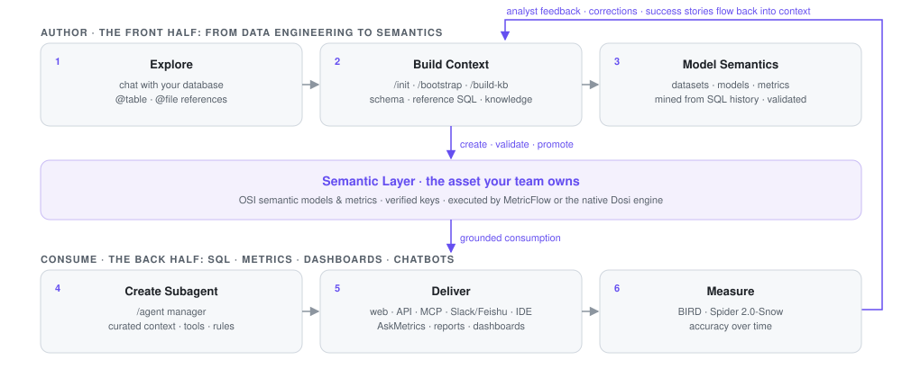
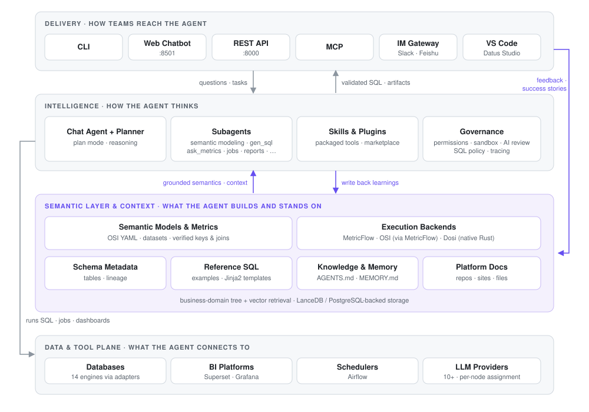

# Introduction

**[Datus](https://github.com/Datus-ai/Datus-agent)** is the open-source data engineering agent for the modern data stack: one agent that connects your warehouse, catalog, semantic layer, and BI, grounded in an evolvable context engine your team owns.

Datus handles SQL authoring and validation, semantic model and metric construction, and the generation of pipelines, reports, and dashboards. Every run and every correction settles into context, which steadily raises the accuracy of its output. The whole stack stays open and flexible: databases, BI, schedulers, LLMs, and your team's own tools all connect through standard interfaces.

## How Datus works

The quality of an agent's answers is set by the quality of the context it receives. Datus therefore concentrates on accumulating and reusing context; the diagram shows the full loop:



The diagram reads in two halves. The front half is the data engineer's work: exploring data, building context, and modeling semantics; its output is reusable assets. The back half is how the organization consumes those assets: subagents turn them into a service anyone can question.

The handoff is not one-way either: every correction an analyst makes flows back, and the assets thicken with use.

1. **Explore**: no groundwork required. Chat with your database in the [CLI](cli/chat_command.md), referencing tables with `@table` and files with `@file`, and get familiar with the data as you go.
2. **Build context**: [`/init`](skills/init.md) scans the current project, and `/bootstrap` and [`/build-kb`](skills/build_kb.md) collect the knowledge scattered across schemas, SQL history, and documents into the [knowledge base](knowledge_base/introduction.md); this is the raw material for all the accuracy that follows.
3. **Model semantics**: the [semantic modeling subagent](subagent/semantic_modeling.md) mines datasets, semantic models, and metrics from your schema and SQL history, validates them, and registers them in the semantic layer; business definitions gain a single, executable form.
4. **Create subagents**: with `/agent`, package the curated context, tools, and rules into a [subagent for one business domain](subagent/customized_subagent.md); from this step on, the assets become a service others can use directly.
5. **Deliver**: analysts ask where they already work, whether that is the browser, Slack/Feishu, or the IDE (see [interfaces](#interfaces)); [AskMetrics](subagent/ask_metrics.md) answers from metric definitions, and [reports and dashboards](subagent/gen_visual_report.md) are generated right in the conversation.
6. **Measure**: [benchmark](benchmark/benchmark_manual.md) SQL accuracy on BIRD, Spider 2.0-Snow, or [your own datasets](configuration/benchmark.md), turning what context adds into a quantified number.

Corrections, feedback, and success stories from stage 5 flow back into the context of stage 2. The assets grow more complete with use, rather than starting to age the day they are built.

## Features

Accuracy comes from two places: the semantic layer turns business definitions into executable form, and the context engine keeps the knowledge produced during use. Subagents deliver those assets to the people who use them, and the plugin ecosystem plus governance let the whole system plug into an existing stack and run under control in production.

### Automated semantic modeling

The agent reads your database schema and SQL history, generates [OSI](https://dosi.datus.ai/) semantic models and metric definitions, validates them, and registers them in the semantic layer, with no hand-written YAML.

Execution belongs to the [Dosi](https://dosi.datus.ai/) engine: one semantic model compiles into SQL for 13+ database dialects. Dosi is an independent program you can also run as a CLI, REST server, or MCP server; see the [Dosi semantic adapter](adapters/dosi_semantic_adapter.md).



### Metric Q&A and attribution

[AskMetrics](subagent/ask_metrics.md) answers business questions from metric definitions instead of improvising SQL, and when a metric moves, `attribution_analyze` quantifies each dimension's contribution.



### A context engine that sharpens with use

The [context engine](getting_started/contextual_data_engineering.md) gathers schema metadata, reference SQL, and business rules, organized in a business-domain tree with vector retrieval on top. Every correction made during use is written back into the [knowledge base](knowledge_base/introduction.md), so later answers keep getting more accurate.



### Subagent delivery

Curate context, tools, and rules for one business domain and package them as a [dedicated chatbot](subagent/customized_subagent.md) that analysts use directly.

- Analysts ask from the browser, Slack/Feishu, or the IDE; [reports and dashboards](subagent/gen_visual_report.md) are generated in the conversation and previewed locally, with no SaaS backend.
- [Built-in subagents](subagent/builtin_subagents.md) also cover engineering tasks such as cross-database migration, ETL job generation, and wide-table builds, with [Airflow](adapters/scheduler_adapters.md) orchestration.



### Plugin ecosystem and governance

- The [plugin](plugin/introduction.md) framework connects third-party platforms and in-house tools to the agent: one `datus-plugin.yml` manifest declares CLI commands, skills, and prompt context, activated per project.
- Adapters cover [15 databases](adapters/db_adapters.md) and 10+ LLM providers, and Datus ships both an [MCP](integration/mcp.md) server and client; [skills](skills/introduction.md) follow the agentskills.io convention and install from a marketplace.
- Governance covers tiered permission profiles, statement-level [SQL authorization](configuration/sql_policy.md) with AI pre-review, bash confined to an OS-level sandbox, and [traces](develop/observability.md) exportable to any OTLP platform.



## Architecture



The architecture has four layers, matching the diagram above:

- **Delivery**: six entry points (CLI, web chatbot, REST API, MCP, IM gateway, and VS Code) that share one agent backend.
- **Intelligence**: the chat agent plans and reasons, subagents handle specialized tasks, skills and plugins add tools, and governance applies here. Interactive requests run in agentic mode, where the agent plans its own steps; benchmark and batch runs use [workflow mode](workflow/introduction.md), which executes a predefined plan of nodes.
- **Semantic layer and context**: the asset layer the agent builds. One half is semantic models and metrics, executed by Dosi or MetricFlow; the other half is [context](knowledge_base/introduction.md): schema metadata, reference SQL, knowledge, and memory. Retrieval combines business-domain trees with vector search, and [storage](configuration/storage.md) defaults to embedded LanceDB and SQLite, with PostgreSQL as the option for teams that share context.
- **Data and tool plane**: the databases, BI platforms, schedulers, and LLM providers reached through adapters.

## Getting started

The first run needs no database of your own: the install bundles the California Schools sample dataset with its datasource `california_schools` pre-registered. Linux or macOS:

```bash
curl -fsSL https://raw.githubusercontent.com/datus-ai/datus-agent/main/install.sh | sh
```

Open a new shell and run `datus`, then:

1. `/model` to configure an LLM
2. `/datasource` to add your own datasource (skip it to stay on the bundled sample)
3. `/init` (optional) to scan the current project

Manual install works too: `pip install datus-agent` (Python 3.12+). Configuration has two levels: a global `agent.yml` for the main settings, and a per-project `.datus/config.yml` for overrides such as the active model and default datasource (see the [configuration docs](configuration/introduction.md)).

The [end-to-end tutorial](getting_started/contextual_data_engineering.md#part-2-hands-on-tutorial-california-schools) runs the full loop on the sample data, building context through metric Q&A, in about ten minutes:

!!! tip "Go deeper"
    [:material-rocket-launch: **Quickstart Guide**](getting_started/Quickstart.md){ .md-button .md-button--primary }
    [:material-school: **End-to-end Tutorial**](getting_started/contextual_data_engineering.md#part-2-hands-on-tutorial-california-schools){ .md-button }

Pipeline and migration work can start from the [Data Engineering Quickstart](getting_started/data_engineering_quickstart.md); for BI-centered scenarios, see [Dashboard Copilot](getting_started/dashboard_copilot.md).

## Interfaces

All six entry points share one agent backend and one body of context: assets built in the CLI apply equally when an analyst asks from the browser or Slack. In the table, `demo` is a sample datasource name for the commands that take `--datasource`; create one first with `/datasource`, or substitute `california_schools` to use the bundled sample.

| Interface | Command | Use Case |
|-----------|---------|----------|
| [**CLI**](cli/introduction.md) (interactive REPL) | `datus --datasource demo` | Data engineers exploring data, building context, creating subagents |
| [**Web Chatbot**](web_chatbot/introduction.md) (FastAPI + React) | `datus --web --datasource demo` | Analysts chatting with subagents via browser (`http://localhost:8501`) |
| [**REST API**](API/introduction.md) (FastAPI) | `datus-api --datasource demo` | Applications consuming data services via REST (`http://localhost:8000`) |
| [**MCP Server**](integration/mcp.md) | `datus-mcp --datasource demo` | MCP-compatible clients (Claude Desktop, Cursor, etc.) |
| [**IM Gateway**](gateway/introduction.md) | `datus-gateway` | Analysts talking to subagents in Slack or Feishu/Lark |
| [**VS Code**](vscode_extension/introduction.md) (Datus Studio) | connects to `datus --web` | Catalog explorer, chat panel, SQL results & AI charts in the IDE |

!!! note "Print mode"
    Print mode streams JSON to stdout for scripting and CI: `datus -p "your question" --datasource demo`.

## Explore the docs

<div class="grid cards" markdown>

-   :material-layers-triple: **Semantic Layer**

    ---

    How semantic models and metrics are generated, stored, and executed by Dosi or MetricFlow.

    [:octicons-arrow-right-24: Semantic adapters](adapters/semantic_adapters.md)

-   :material-robot-outline: **Subagents**

    ---

    Package context, tools, and rules for one domain into a chatbot analysts can use directly.

    [:octicons-arrow-right-24: Explore subagents](subagent/introduction.md)

-   :material-database: **Knowledge Base**

    ---

    The context engine's storage: metadata, semantic models, metrics, reference SQL, and memory.

    [:octicons-arrow-right-24: Browse knowledge base](knowledge_base/introduction.md)

-   :material-puzzle-outline: **Plugins**

    ---

    Connect third-party platforms and in-house tools through a single manifest.

    [:octicons-arrow-right-24: Learn about plugins](plugin/introduction.md)

-   :material-console-line: **CLI**

    ---

    The interactive REPL: chat, context, and execution commands, MCP extensions, and plan mode.

    [:octicons-arrow-right-24: CLI reference](cli/introduction.md)

-   :material-tools: **Skills**

    ---

    Built-in and installable skills, including project init, knowledge extraction, and memory organization.

    [:octicons-arrow-right-24: Browse skills](skills/introduction.md)

-   :material-cog-outline: **Configuration**

    ---

    Datasources, models, semantic layer, SQL policy, storage, and everything else in `agent.yml`.

    [:octicons-arrow-right-24: Configure Datus](configuration/introduction.md)

-   :material-speedometer: **Benchmark**

    ---

    Measure SQL accuracy on BIRD, Spider 2.0-Snow, or datasets you define yourself.

    [:octicons-arrow-right-24: Run benchmarks](benchmark/benchmark_manual.md)

</div>
