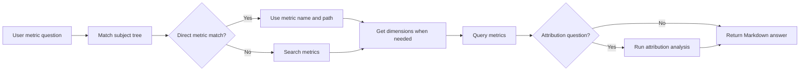

# AskMetrics Guide

## Overview

`ask_metrics` is a built-in metric question-answering subagent. It answers questions from existing semantic metrics instead of exploring raw tables or asking the model to write ad hoc SQL; Dosi compiles and executes the query.

Use AskMetrics when the user asks for:

- KPI values, such as "What was revenue last month?"
- Metric trends, such as "How did shipped quantity change by month?"
- Grouped metric results, such as "Revenue by region for Q1"
- Metric attribution, such as "Which customer segment drove the revenue drop?"

AskMetrics is intentionally narrow. If no existing metric can answer the question, it says so directly and does not fall back to raw SQL.

## Prerequisites

AskMetrics needs executable semantic metrics on the current datasource. Dosi is built in. See [Dosi Semantic Engine](../semantic/dosi_engine.md) for model discovery.

Metrics can come from existing OSI models or from the [`semantic_modeling`](semantic_modeling.md) subagent. After `semantic_modeling` successfully returns `generated`, it validates the target YAML and syncs the metrics to the Knowledge Base. They are immediately available on the same datasource without a manual publish, import, or Datus restart.

A metric subject tree is optional, but recommended because AskMetrics uses it as a routing catalog before searching.

## Quick Start: Query Newly Generated Metrics

Continue from the DuckDB example in [Semantic Modeling](semantic_modeling.md#quickstart-with-the-built-in-duckdb-sample) and start Datus with the same datasource:

```bash
datus --datasource duckdb_demo
```

After creating the `bank_failures` model, ask the question directly in the main chat. The main agent delegates it to AskMetrics automatically:

```text
Show bank failure count and failed assets by year.
```

AskMetrics matches the business wording against the subject tree and metric definitions, selecting the generated `bank_failure_count` and `failed_assets_million` metrics without requiring the user to know their names. This query uses yearly `date` buckets. The real test returned 14 yearly groups; for example, 2008 returned `26` and `768576.8`, while 2024 returned `2` and `6107.8`.

If `/agent semantic_modeling` was used to make the authoring agent current, return to the main chat first:

```text
/agent chat
```

To route one question explicitly, use an agent reference:

```text
Show the number of failed banks and their total assets by year. @Agent ask_metrics
```

For several consecutive metric questions, select AskMetrics first and then enter normal messages:

```text
/agent ask_metrics
```

The legacy `/ask_metrics <question>` form is no longer supported. Web/API callers can route directly by using `subagent_id: "ask_metrics"`.

AskMetrics is scoped to the current datasource. If the user asks for another datasource, switch datasource first and ask again.

## How It Works

AskMetrics follows a metric-first workflow:



Key behavior:

- Direct subject-tree matches are preferred over search.
- `search_metrics` is used only when the subject tree is missing, partial, or ambiguous.
- `get_metric` is called before grouping, filtering, or attribution.
- Grouping names come directly from `get_metric.dimensions[].name`, including dataset qualification where present.
- `query_metrics` is the primary tool for metric values.
- `attribution_analyze` is used for change explanation and contribution questions.
- Raw SQL tools are not part of the default AskMetrics surface.

## Default Tools

| Tool | Purpose |
|------|---------|
| `context_search_tools.search_metrics` | Find candidate metrics when direct subject-tree matching is not enough |
| `context_search_tools.list_subject_tree` | List metric subject paths when the startup subject tree is too large to inline |
| `semantic_tools.list_metrics` | Enumerate executable metrics from Dosi |
| `semantic_tools.get_metric` | Describe one metric: its queryable dimensions, time axis, and grains |
| `semantic_tools.query_metrics` | Query metric values |
| `semantic_tools.attribution_analyze` | Explain metric movement across candidate dimensions |

If the Dosi runtime is unavailable, AskMetrics cannot safely answer metric questions. If context search is unavailable, AskMetrics can still query Dosi, but it will not have subject-tree routing context.

## Output

AskMetrics returns a concise Markdown report with:

- the interpreted question and time range
- the metric names used
- the result values from metric tools
- attribution findings when attribution was run
- limitations when the question cannot be answered with existing metrics

It does not return raw SQL and does not invent metric values.

## Configuration

The built-in `ask_metrics` subagent works once the current datasource has executable metrics. You can override its model and turn budget:

```yaml
agent:
  agentic_nodes:
    ask_metrics:
      model: claude
      max_turns: 12
      subject_tree_prompt_limit: 100
```

### Custom AskMetrics Agents

Use `type: ask_metrics` to create a custom metric QA agent with its own name, prompt template, or tool allowlist:

```yaml
agent:
  agentic_nodes:
    sales_metric_qa:
      type: ask_metrics
      model: claude
      max_turns: 12
      prompt_version: "1.0"
      tools: "context_search_tools.search_metrics,semantic_tools.get_metric,semantic_tools.query_metrics"
      subject_tree_prompt_limit: 50
      agent_description: "Answer sales metric questions using the sales semantic layer."
```

When `system_prompt` is omitted, Datus first looks for a prompt template matching the custom agent name, such as `sales_metric_qa_system_1.0.j2`, then falls back to the built-in `ask_metrics_system` template.

`tools` can be a comma-separated string or a list. The default surface is metric-focused. Custom agents can opt into other user-facing tool categories when needed, but keeping AskMetrics metric-only produces more deterministic answers.

For existing custom tool lists, remove `context_search_tools.get_metrics`. Use `semantic_tools.get_metric` when the metric definition is needed; `context_search_tools.search_metrics` remains available for discovery.

## When Not To Use AskMetrics

Use another subagent when the task is not answerable through existing semantic metrics:

| Need | Use |
|------|-----|
| Generate new Dosi metric definitions from SQL | [semantic_modeling](semantic_modeling.md) |
| Generate or fix SQL over raw tables | [gen_sql](builtin_subagents.md#gen_sql) |
| Explore schemas, samples, or reference context | [explore](builtin_subagents.md#explore) |
| Build a visual report artifact | [gen_visual_report](gen_visual_report.md) |
| Create a dashboard in an external BI tool | Ask the main agent to use the installed BI plugin directly |
