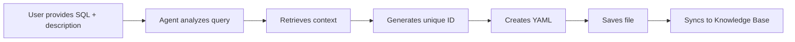
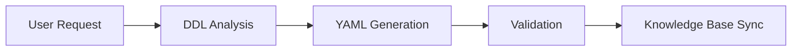
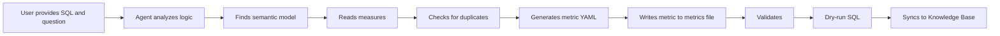
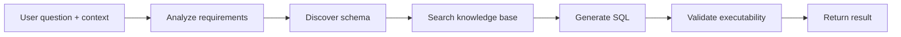
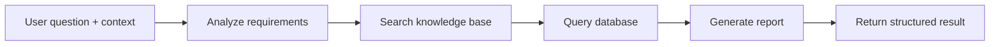

# Builtin Subagent

## Overview

The **Builtin Subagent** are specialized AI assistants integrated within the Datus Agent system. Each subagent focuses on a specific aspect of data engineering automation — analyzing SQL, generating semantic models, and converting queries into reusable metrics — together forming a closed-loop workflow from raw SQL to knowledge-aware data products.

This document covers the core subagents:

1. **[gen_sql_summary](#gen_sql_summary)** — Summarizes and classifies SQL queries
2. **[semantic_modeling](semantic_modeling.md)** — Authors Dosi semantic models and metrics
3. **[ask_metrics](ask_metrics.md)** — Answers KPI, trend, grouped metric, and attribution questions from existing semantic metrics
4. **[explore](#explore)** — Read-only data exploration and context gathering
5. **[gen_sql](#gen_sql)** — Specialized SQL generation with deep expertise
6. **[gen_report](#gen_report)** — Flexible report generation with configurable tools
7. **[gen_table](gen_table.md)** — Database table creation via CTAS or natural language
8. **[gen_job](gen_job.md)** — Data pipeline execution (single-database ETL AND cross-database migration with reconciliation)
9. **[gen_skill](#gen_skill)** — Skill creation and optimization
10. **[gen_visual_report](gen_visual_report.md)** — Self-contained visual report under `reports/<slug>/`

Airflow scheduling and external BI authoring are handled directly by the main
agent through installed plugins. They are not built-in or custom subagents.

## Configuration

Builtin subagents work out of the box with minimal configuration. Most settings (tools, hooks, MCP servers, system prompts) are built-in. You can optionally customize them in your `agent.yml` file:

```yaml
agent:
  agentic_nodes:
    semantic_modeling:
      model: claude     # Optional: defaults to configured model
      max_turns: 30     # Optional: defaults to 30

    ask_metrics:
      model: claude     # Optional: defaults to configured model
      max_turns: 12     # Optional: defaults to 12

    gen_sql_summary:
      model: deepseek   # Optional: defaults to configured model
      max_turns: 30     # Optional: defaults to 30

    explore:
      model: haiku      # Recommended: smaller model for tool-calling tasks
      max_turns: 15     # Optional: defaults to 15

    gen_sql:
      model: claude     # Optional: defaults to configured model
      max_turns: 30     # Optional: defaults to 30

    gen_report:
      model: claude     # Optional: defaults to configured model
      max_turns: 30     # Optional: defaults to 30
      tools: "semantic_tools.*, context_search_tools.list_subject_tree"  # Optional: defaults to semantic + context tools

    gen_table:
      max_turns: 20     # Optional: defaults to 20

    gen_job:
      max_turns: 30     # Optional: defaults to 30

    gen_skill:
      max_turns: 30     # Optional: defaults to 30

    gen_visual_report:
      model: claude            # Optional: defaults to configured model
      max_turns: 30            # Optional: defaults to 30
      report_dist: ~/report_dist  # Optional: local dist path for offline HTML compilation
```

**Optional configuration parameters:**

- `model`: The AI model to use (e.g., `claude`, `deepseek`). Defaults to your configured model.
- `max_turns`: Maximum conversation turns (default: 30)

**Built-in configurations** (no setup needed):
- **Tools**: Automatically configured based on subagent type
- **Hooks**: Workflow-specific validation and Knowledge Base sync
- **Semantic adapter tools**: Dosi validation and query tools for `semantic_modeling`
- **System Prompts**: Built-in templates; latest versions are used unless `prompt_version` is set
- **Workspace**: `~/.datus/data/{datasource}/` with subagent-specific subdirectories

---

## gen_sql_summary

### Overview

The SQL Summary feature helps you analyze, classify, and catalog SQL queries for knowledge reuse. It automatically generates structured YAML summaries that are stored in a searchable Knowledge Base, making it easy to find and reuse similar queries in the future.

### What is a SQL Summary?

A **SQL summary** is a structured YAML document that captures:

- **Query Text**: The complete SQL query
- **Business Context**: Domain, categories, and tags
- **Semantic Summary**: Detailed explanation for vector search
- **Metadata**: Name, comment, file path

### Quick Start

Launch the SQL summary generation subagent:

```bash
/gen_sql_summary Analyze this SQL: SELECT SUM(revenue) FROM sales GROUP BY region. (You can also add some description on this SQL)
```

### Generation Workflow



**Detailed Steps:**

1. **Understand SQL**: The AI analyzes your query structure and business logic
2. **Get Context**: Automatically retrieves from Knowledge Base:
   - Existing subject trees (domain/layer1/layer2 combinations)
   - Similar SQL summaries (top 5 most similar queries) for classification reference
3. **Generate Unique ID**: Uses `generate_sql_summary_id()` tool based on SQL + comment
4. **Create Unique Name**: Generates a descriptive name (max 20 characters)
5. **Classify Query**: Assigns domain, layer1, layer2, and tags following existing patterns
6. **Generate YAML**: Creates structured summary document
7. **Save File**: Writes YAML to workspace using `write_file()` tool
8. **Sync to Knowledge Base**: Stores in LanceDB for semantic search

### Sync Behavior

In interactive mode, after the YAML file is written successfully, the generation hook syncs it to the Knowledge Base automatically. In workflow/API mode, use the corresponding explicit sync step or tool.

### Subject Tree Categorization

Subject tree allows organizing SQL summaries by domain and layers. In CLI mode, include it in your question:

**Example with subject_tree:**
```bash
/gen_sql_summary Analyze this SQL: SELECT SUM(revenue) FROM sales, subject_tree: sales/reporting/revenue_analysis
```

**Example without subject_tree:**
```bash
/gen_sql_summary Analyze this SQL: SELECT SUM(revenue) FROM sales
```

When not provided, the agent suggests categories based on existing subject trees and similar queries in the Knowledge Base.

### YAML Structure

The generated SQL summary follows this structure:

```yaml
id: "abc123def456..."                      # Auto-generated MD5 hash
name: "Revenue by Region"                  # Descriptive name (max 20 chars)
sql: |                                     # Complete SQL query
  SELECT
    region,
    SUM(revenue) as total_revenue
  FROM sales
  GROUP BY region
comment: "Calculate total revenue grouped by region"
summary: "This query aggregates total revenue from the sales table, grouping results by geographic region. It uses SUM aggregation to calculate revenue totals for each region."
filepath: "/Users/you/.datus/data/reference_sql/revenue_by_region.yml"
domain: "Sales"                            # Business domain
layer1: "Reporting"                        # Primary category
layer2: "Revenue Analysis"                 # Secondary category
tags: "revenue, region, aggregation"       # Comma-separated tags
```

#### Field Descriptions

| Field | Required | Description | Example |
|-------|----------|-------------|---------|
| `id` | Yes | Unique hash (auto-generated) | `abc123def456...` |
| `name` | Yes | Short descriptive name (max 20 chars) | `Revenue by Region` |
| `sql` | Yes | Complete SQL query | `SELECT ...` |
| `comment` | Yes | Brief one-line description | User's message or generated summary |
| `summary` | Yes | Detailed explanation (for search) | Comprehensive query description |
| `filepath` | Yes | Actual file path | `/path/to/file.yml` |
| `domain` | Yes | Business domain | `Sales`, `Marketing`, `Finance` |
| `layer1` | Yes | Primary category | `Reporting`, `Analytics`, `ETL` |
| `layer2` | Yes | Secondary category | `Revenue Analysis`, `Customer Insights` |
| `tags` | Optional | Comma-separated keywords | `revenue, region, aggregation` |

---

## gen_semantic_model

> Retired. This name is hidden and direct invocation fails with guidance to use
> [`semantic_modeling`](semantic_modeling.md). Its configuration is retained only
> for compatibility with existing installations.

### Overview

The semantic model generation feature helps you create MetricFlow semantic models from database tables through an AI-powered assistant. The assistant analyzes your table structure and generates comprehensive YAML configuration files that define metrics, dimensions, and relationships.

### What is a Semantic Model?

A semantic model is a YAML configuration that defines:

- **Measures**: Metrics and aggregations (SUM, COUNT, AVERAGE, etc.)
- **Dimensions**: Categorical and time-based attributes
- **Identifiers**: Primary and foreign keys for relationships
- **Data Source**: Connection to your database table

### Quick Start

Start Datus CLI with `datus --datasource <datasource>`, and begin with a subagent command:

```bash
/gen_semantic_model generate a semantic model for table <table_name>
```

### How It Works

#### Interactive Generation

When you request a semantic model, the AI assistant:

1. Retrieves your table's DDL (structure)
2. Checks if a semantic model already exists
3. Generates a comprehensive YAML file
4. Validates the configuration using MetricFlow
5. Syncs it to the Knowledge Base after validation passes

#### Generation Workflow



### Validation and Sync

The agent calls `validate_semantic()` before publishing. If validation fails, it edits the YAML and retries. Once validation passes, `publish_semantic_model` validates the publication evidence and syncs the artifact to the Knowledge Base in every execution mode.

### Semantic Model Structure

#### Basic Template

```yaml
data_source:
  name: table_name                    # Required: lowercase with underscores
  description: "Table description"

  sql_table: schema.table_name        # For databases with schemas
  # OR
  sql_query: |                        # For custom queries
    SELECT * FROM table_name

  measures:
    - name: total_amount              # Required
      agg: SUM                        # Required: SUM|COUNT|AVERAGE|etc.
      expr: amount_column             # Column or SQL expression
      create_metric: true             # Auto-create queryable metric
      description: "Total transaction amount"

  dimensions:
    - name: created_date
      type: TIME                      # Required: TIME|CATEGORICAL
      type_params:
        is_primary: true              # One primary time dimension required
        time_granularity: DAY         # Required for TIME: DAY|WEEK|MONTH|etc.

    - name: status
      type: CATEGORICAL
      description: "Order status"

  identifiers:
    - name: order_id
      type: PRIMARY                   # PRIMARY|FOREIGN|UNIQUE|NATURAL
      expr: order_id

    - name: customer
      type: FOREIGN
      expr: customer_id
```

### Summary

The semantic model generation feature provides:

- ✅ Automated YAML generation from table DDL
- ✅ Built-in tools, hooks, and MCP server integration
- ✅ Interactive validation and error fixing
- ✅ Validation-gated Knowledge Base sync
- ✅ One validation-gated publish path in every execution mode
- ✅ Duplicate prevention
- ✅ MetricFlow compatibility

---

## gen_metrics

> Retired. This name is hidden and direct invocation fails with guidance to use
> [`semantic_modeling`](semantic_modeling.md). Its configuration is retained only
> for compatibility with existing installations.

### Overview

The metrics generation feature helps you convert SQL queries into reusable MetricFlow metric definitions. Using an AI assistant, you can analyze SQL business logic and automatically generate standardized YAML metric configurations that can be queried consistently across your organization.

### What is a Metric?

A **metric** is a reusable business calculation built on top of semantic models. Metrics provide:

- **Consistent Business Logic**: One definition, used everywhere
- **Type Safety**: Validated structure and measure references
- **Metadata**: Display names, formats, business context
- **Composability**: Build complex metrics from simpler ones

**Example**: Instead of writing `SELECT SUM(revenue) / COUNT(DISTINCT customer_id)` repeatedly, define an `avg_customer_revenue` metric once.

### Quick Start

Start Datus CLI with `datus --datasource <datasource>`, and use the metrics generation subagent:

```bash
/gen_metrics Generate a metric from this SQL: SELECT SUM(amount) FROM transactions, the corresponding question is total amount of all transactions
```

### How It Works

#### Generation Workflow



#### Important Limitations

> **⚠️ Single Table Queries Only**
>
> The current version **only supports generating metrics from single-table SQL queries**. Multi-table JOINs are not supported.

**Supported:**
```sql
SELECT SUM(revenue) FROM transactions WHERE status = 'completed'
SELECT COUNT(DISTINCT customer_id) / COUNT(*) FROM orders
```

**Not Supported:**
```sql
SELECT SUM(o.amount)
FROM orders o
JOIN customers c ON o.customer_id = c.id  -- ❌ JOIN not supported
```

### Validation and Sync

Before publishing, the agent validates the YAML with `validate_semantic()` and compiles SQL with `query_metrics(..., dry_run=True)`. After both checks pass, `publish_metrics` validates the request-local evidence and syncs the metric in every execution mode.

### Subject Tree Categorization

Subject tree allows organizing metrics by domain and layers. In CLI mode, include it in your question:

**Example with subject_tree:**
```bash
/gen_metrics Generate a metric from this SQL: SELECT SUM(amount) FROM transactions, subject_tree: finance/revenue/transactions
```

**Example without subject_tree:**
```bash
/gen_metrics Generate a metric from this SQL: SELECT SUM(amount) FROM transactions
```

When not provided, the agent operates in learning mode and suggests categories based on existing metrics in the Knowledge Base.

### Usage Examples

#### Example 1: Simple Aggregation

**User Input:**
```bash
/gen_metrics Generate a metric for total order count
```

**Agent Actions:**
1. Finds `orders.yml` semantic model
2. Reads file to discover `order_count` measure
3. Generates MEASURE_PROXY metric:

```yaml
---
metric:
  name: total_orders
  description: Total number of orders
  type: measure_proxy
  type_params:
    measure: order_count
  locked_metadata:
    display_name: "Total Orders"
    increase_is_good: true
```

#### Example 2: Conversion Rate

**User Input:**
```bash
/gen_metrics Create a metric from this SQL:
SELECT
  COUNT(DISTINCT CASE WHEN status = 'completed' THEN order_id END) /
  COUNT(DISTINCT order_id) AS completion_rate
FROM orders
```

**Agent Actions:**
1. Analyzes SQL logic (ratio with conditional counting)
2. Finds `orders.yml` and reads measures
3. Generates RATIO metric with constraint:

```yaml
---
metric:
  name: order_completion_rate
  description: Percentage of orders that reached completed status
  type: ratio
  type_params:
    numerator:
      name: order_count
      constraint: status = 'completed'
    denominator: order_count
  locked_metadata:
    display_name: "Order Completion Rate"
    value_format: ".2%"
    increase_is_good: true
```

#### Example 3: Complex Calculation

**User Input:**
```bash
/gen_metrics Generate average basket size metric:
SELECT SUM(total_amount) / COUNT(DISTINCT order_id)
FROM order_items
```

**Agent Actions:**
1. Locates `order_items.yml`
2. Identifies this as a RATIO (average)
3. Generates metric:

```yaml
---
metric:
  name: avg_basket_size
  description: Average order value (basket size)
  type: ratio
  type_params:
    numerator: total_amount
    denominator: order_count
  locked_metadata:
    display_name: "Average Basket Size"
    value_format: "$$,.2f"
    unit: "dollars"
    increase_is_good: true
```

### How Metrics Are Stored

#### File Organization

Metrics are stored in dedicated files, separate from their semantic models:

- **Semantic Model**: `{table_name}.yml` — `data_source` definition (measures, dimensions, identifiers)
- **Metrics**: `metrics/{table_name}_metrics.yml` — one or more metric definitions, separated by the YAML document separator `---`

**Semantic Model File** (`transactions.yml`):
```yaml
data_source:
  name: transactions
  sql_table: transactions
  measures:
    - name: revenue
      agg: SUM
      expr: amount
  dimensions:
    - name: transaction_date
      type: TIME
```

**Metrics File** (`metrics/transactions_metrics.yml`):
```yaml
metric:
  name: total_revenue
  type: measure_proxy
  type_params:
    measure: revenue

---
metric:
  name: avg_transaction_value
  type: ratio
  type_params:
    numerator: revenue
    denominator: transaction_count
```

**Why separate files?**
- Clear separation between schema definitions and business metrics
- Metrics can be maintained independently from the underlying semantic model
- MetricFlow validates all YAML documents under the semantic model directory together

See [gen_metrics](gen_metrics.md) for full details.

#### Knowledge Base Storage

After validation and dry-run SQL succeed, the metric is synced to the Knowledge Base with:

1. **Metadata**: Name, description, type, domain/layer classification
2. **LLM Text**: Natural language representation for semantic search
3. **References**: Associated semantic model name
4. **Timestamp**: Creation date

### Summary

The metrics generation feature provides:

- ✅ **SQL-to-Metric Conversion**: Analyze SQL queries and generate MetricFlow metrics
- ✅ **Intelligent Type Detection**: Automatically selects the right metric type
- ✅ **Duplicate Prevention**: Checks for existing metrics before generation
- ✅ **Subject Tree Support**: Organize by domain/layer1/layer2 with predefined or learned categories
- ✅ **Validation**: MetricFlow validation ensures correctness
- ✅ **Publish Gate**: Syncs only after semantic validation and dry-run SQL succeed
- ✅ **Knowledge Base Integration**: Semantic search for metric discovery
- ✅ **File Management**: Maintains dedicated per-table metrics files under `metrics/`

---

## explore

### Overview

The explore subagent is a lightweight, read-only assistant designed for fast context gathering. It helps collect schema information, data samples, and knowledge base context to support downstream SQL generation — either by the chat agent or the gen_sql subagent.

### Key Features

- **Strictly read-only**: Never modifies data, files, or database records. Only SELECT queries are allowed, always with LIMIT.
- **Fast exploration**: Limited to 15 conversation turns for quick context gathering.
- **Three exploration directions**:
  - **Schema+Sample**: Discover tables, columns, types, constraints, and sample data
  - **Knowledge**: Search metrics, reference SQL, business rules, and domain knowledge
  - **File**: Browse workspace SQL files and documentation

### Configuration

```yaml
agent:
  agentic_nodes:
    explore:
      model: haiku           # Recommended: use a smaller model (haiku, gpt-4o-mini)
      max_turns: 15           # Optional: defaults to 15
```

> **Tip**: The explore subagent is optimized for tool-calling rather than reasoning. Using a smaller, faster model (e.g., `haiku`, `gpt-4o-mini`) is recommended to reduce cost and improve speed without sacrificing quality.

### Available Tools

| Tool Category | Tools | Purpose |
|---------------|-------|---------|
| Database | `list_databases`, `list_schemas`, `list_tables`, `search_table`, `describe_table`, `read_query` | Schema discovery and data sampling (read-only) |
| Context Search | `search_metrics`, `search_reference_sql`, `search_knowledge`, `search_semantic_objects`, `list_subject_tree`, `get_metrics`, `get_reference_sql`, `get_knowledge` | Knowledge base retrieval |
| Filesystem | `read_file`, `glob`, `grep` | Read-only file browsing |
| Date Parsing | `get_current_date`, `parse_temporal_expressions` | Date context |

### Output Format

The explore subagent returns a concise, structured summary optimized for consumption by other agents:

- **Tables**: Relevant tables with key columns, types, and notes
- **Joins**: Join paths between tables (one line per relationship)
- **Data patterns**: Non-obvious data patterns (delimiters, encodings, NULL prevalence)
- **Context**: Relevant metrics, reference SQL, and business rules found
- **Recommendation**: Which tables to use, how to join, and key caveats

### Usage

The explore subagent is typically invoked automatically by the chat agent via `task(type="explore")`, but can also be launched manually:

```bash
/explore Discover tables related to customer revenue and find relevant metrics
```

---

## gen_sql

### Overview

The gen_sql subagent is a specialized SQL expert that generates optimized, validated SQL queries. It handles complex SQL generation tasks that require multi-step reasoning, intricate joins, or domain-specific logic.

### Key Features

- **Deep SQL expertise**: Specialized in writing complex, production-quality SQL
- **Automatic validation**: Validates SQL executability before returning results
- **File-based output**: For complex queries (50+ lines), outputs SQL to a file with a preview
- **Modification support**: Returns unified diff format when modifying existing queries

### Configuration

```yaml
agent:
  agentic_nodes:
    gen_sql:
      model: claude           # Optional: defaults to configured model
      max_turns: 30           # Optional: defaults to 30
```

### How It Works



### Output Format

The gen_sql subagent returns results in one of two formats:

**Inline SQL** (for shorter queries):
```json
{
  "sql": "SELECT region, SUM(revenue) FROM sales GROUP BY region",
  "response": "Explanation of the query...",
  "tokens_used": 1234
}
```

**File-based SQL** (for complex queries 50+ lines):
```json
{
  "sql_file_path": "/path/to/generated_query.sql",
  "sql_preview": "First few lines of the query...",
  "response": "Explanation of the query...",
  "tokens_used": 5678
}
```

### Usage

The gen_sql subagent is typically invoked automatically by the chat agent via `task(type="gen_sql")` for complex queries, but can also be launched manually:

```bash
/gen_sql Generate a query to calculate customer lifetime value with cohort analysis
```

---

## gen_report

### Overview

The gen_report subagent is a flexible report generation assistant that combines semantic tools, database tools, and context search capabilities to produce structured reports. It can be used directly or extended by specialized report nodes for domain-specific reporting tasks (e.g., attribution analysis).

### Key Features

- **Configurable tools**: Supports `semantic_tools.*`, `db_tools.*`, and `context_search_tools.*` via configuration
- **Flexible output**: Generates structured report content with SQL queries and analysis
- **Extensible**: Can be subclassed for specialized report types
- **Configuration-driven**: Tool setup and system prompts are driven by `agent.yml` configuration

### Configuration

```yaml
agent:
  agentic_nodes:
    gen_report:
      model: claude           # Optional: defaults to configured model
      max_turns: 30           # Optional: defaults to 30
      tools: "semantic_tools.*, db_tools.*, context_search_tools.list_subject_tree"  # Optional: customize available tools
```

**Tool patterns:**

| Pattern | Description |
|---------|-------------|
| `semantic_tools.*` | All semantic tools (search metrics, semantic objects, etc.) |
| `db_tools.*` | All database tools (list tables, describe table, read query, etc.) |
| `context_search_tools.*` | All context search tools (search knowledge, reference SQL, etc.) |
| `semantic_tools.search_metrics` | A specific semantic tool method |
| `context_search_tools.list_subject_tree` | A specific context search method |

Default tools (when not configured): `semantic_tools.*, context_search_tools.list_subject_tree`

### How It Works



### Output Format

The gen_report subagent returns results as a structured report:

```json
{
  "report": "Structured report content with analysis...",
  "response": "Summary explanation...",
  "tokens_used": 2345
}
```

### Usage

The gen_report subagent can be launched manually or invoked by the chat agent via `task(type="gen_report")`:

```bash
/gen_report Analyze the revenue trend for the last quarter and provide insights
```

### Custom Report Subagents

You can create custom subagents that use the gen_report node class by configuring them in `agent.yml`:

```yaml
agent:
  agentic_nodes:
    attribution_report:
      node_class: gen_report
      tools: "semantic_tools.*, db_tools.*, context_search_tools.*"
      max_turns: 30
```

Then use it via `/attribution_report Analyze the conversion attribution for campaign X`.

---

## gen_skill

### Overview

The `gen_skill` subagent guides users through creating or optimizing Datus skills. It can inspect existing skills, scaffold new skill directories, edit `SKILL.md`, validate the result, and search prior sessions for usage patterns.

### Key Features

- **Interactive skill authoring**: interview-style workflow with `ask_user`
- **Scoped filesystem access**: read-only workspace tools plus write access to the configured skills directory
- **Skill-aware editing**: load existing skills before revising them
- **Validation support**: built-in `validate_skill` checks before finishing

### Configuration

```yaml
agent:
  agentic_nodes:
    gen_skill:
      model: claude
      max_turns: 30
```

### Output Format

```json
{
  "response": "Created a new validation skill for finance dashboards.",
  "skill_name": "finance-dashboard-validation",
  "skill_path": "/path/to/skills/finance-dashboard-validation",
  "tokens_used": 1980
}
```

### Usage

Launch it directly:

```bash
/gen_skill Create a skill that validates daily revenue dashboards before publishing
```

Or let the chat agent delegate via `task(type="gen_skill")`.

---

## Plugin-backed Platform Operations

Airflow scheduling and external BI authoring (for example Superset) run in the
main agent through installed plugins and their bundled skills. They are not
available through the `task()` tool, slash commands, the agent API, or custom
aliases.

The legacy node implementations remain in the codebase temporarily for
compatibility only. See [BI Dashboard Node (Legacy)](gen_dashboard.md) and
[Scheduler Node (Legacy)](scheduler.md) for migration guidance.

---

## Summary

| Subagent | Purpose | Output | Stored In | Key Features |
|----------|---------|--------|-----------|--------------|
| `gen_sql_summary` | Summarize and classify SQL queries | YAML (SQL summary) | `/data/reference_sql` | Subject tree categorization, auto context retrieval |
| `semantic_modeling` | Author semantic models and metrics | Dosi YAML | `/data/semantic_models` | Unified validation and full Knowledge Base reconcile |
| `ask_metrics` | Answer existing metric questions | Markdown report | N/A | KPI values, trends, grouped results, attribution, no raw SQL fallback |
| `explore` | Read-only data exploration | Structured context | N/A | Strictly read-only, fast turn budget, three exploration directions |
| `gen_sql` | Generate optimized SQL | SQL query / SQL file | N/A | Deep SQL expertise, auto-validation, file-based output |
| `gen_report` | Flexible report generation | Structured report | N/A | Configurable tools, extensible, custom report subagents |
| `gen_table` | Create tables interactively | DDL + execution result | Database | DDL confirmation, CTAS or natural-language schema creation |
| `gen_job` | Data pipeline jobs (intra-DB ETL + cross-DB transfer) | Job / transfer result | Source + target databases | DDL/DML execution, cross-dialect type mapping via MigrationTargetMixin, `transfer_query_result`, lightweight reconciliation when source != target |
| `gen_skill` | Create or optimize skills | Skill path | Skills directory | Interactive authoring, validation, skill loading |
| `gen_visual_report` | Self-contained visual report (narrative, pre-baked queries) | `reports/<slug>/` (executable SQL + executed results + report components) | Project root | Modular section-by-section edits, generate from metrics or your own SQL, CLI auto-opens the report in your browser |

**Built-in Features Across All Subagents:**
- Minimal configuration required (only `model` and `max_turns` optional)
- Automatic tool setup, hooks, and MCP server integration
- Built-in system prompts, with the latest available version selected by default
- Workflow-specific validation and Knowledge Base sync
- Knowledge Base integration for semantic search
- Automatic workspace management

Together, these subagents automate the **data engineering knowledge pipeline** — from **data exploration → query generation → model definition → metric generation → business knowledge capture → searchable Knowledge Base**.
