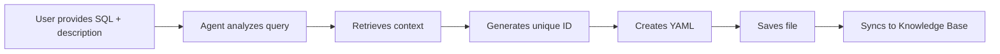
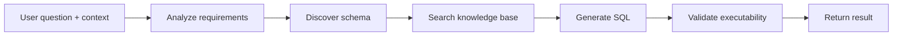
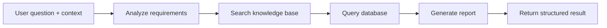

# Builtin Subagent

## Overview

The **Builtin Subagent** are specialized AI assistants integrated within the Datus Agent system. Each subagent focuses on a specific aspect of data engineering automation — analyzing SQL, generating semantic models, and converting queries into reusable metrics — together forming a closed-loop workflow from raw SQL to knowledge-aware data products.

This document covers the core subagents:

1. **[gen_sql_summary](#gen_sql_summary)** — Summarizes and classifies SQL queries
2. **[semantic_modeling](semantic_modeling.md)** — Authors Dosi semantic models and metrics
3. **[ask_metrics](ask_metrics.md)** — Answers KPI, trend, grouped metric, and attribution questions from existing semantic metrics
4. **[explore](#explore)** — Read-only data exploration and context gathering
5. **[gen_sql](#gen_sql)** — Specialized SQL generation with deep expertise
6. **[gen_report](#gen_report)** — Flexible report generation with configurable tools
7. **[gen_table](gen_table.md)** — Database table creation via CTAS or natural language
8. **[gen_job](gen_job.md)** — Data pipeline execution (single-database ETL AND cross-database migration with reconciliation)
9. **[gen_skill](#gen_skill)** — Skill creation and optimization
10. **[gen_visual_report](gen_visual_report.md)** — Self-contained visual report under `reports/<slug>/`

Airflow scheduling and external BI authoring are handled directly by the main
agent through installed plugins. They are not built-in or custom subagents.

In the REPL, describe the task directly and the main agent will route it to the
appropriate subagent. To select one explicitly for a single message, append
`@Agent <name>` to the request; `/agent <name>` switches the current agent for
subsequent messages. The legacy `/<subagent> <message>` form is not supported.

## Configuration

Builtin subagents work out of the box with minimal configuration. Most settings (tools, hooks, MCP servers, system prompts) are built-in. You can optionally customize them in your `agent.yml` file:

```yaml
agent:
  agentic_nodes:
    semantic_modeling:
      model: claude     # Optional: defaults to configured model
      max_turns: 30     # Optional: defaults to 30

    ask_metrics:
      model: claude     # Optional: defaults to configured model
      max_turns: 12     # Optional: defaults to 12

    gen_sql_summary:
      model: deepseek   # Optional: defaults to configured model
      max_turns: 30     # Optional: defaults to 30

    explore:
      model: haiku      # Recommended: smaller model for tool-calling tasks
      max_turns: 15     # Optional: defaults to 15

    gen_sql:
      model: claude     # Optional: defaults to configured model
      max_turns: 30     # Optional: defaults to 30

    gen_report:
      model: claude     # Optional: defaults to configured model
      max_turns: 30     # Optional: defaults to 30
      tools: "semantic_tools.*, context_search_tools.list_subject_tree"  # Optional: defaults to semantic + context tools

    gen_table:
      max_turns: 20     # Optional: defaults to 20

    gen_job:
      max_turns: 30     # Optional: defaults to 30

    gen_skill:
      max_turns: 30     # Optional: defaults to 30

    gen_visual_report:
      model: claude            # Optional: defaults to configured model
      max_turns: 30            # Optional: defaults to 30
      report_dist: ~/report_dist  # Optional: local dist path for offline HTML compilation
```

**Optional configuration parameters:**

- `model`: The AI model to use (e.g., `claude`, `deepseek`). Defaults to your configured model.
- `max_turns`: Maximum conversation turns (default: 30)

**Built-in configurations** (no setup needed):
- **Tools**: Automatically configured based on subagent type
- **Hooks**: Workflow-specific validation and Knowledge Base sync
- **Dosi tools**: Dosi validation and query tools for `semantic_modeling`
- **System Prompts**: Built-in templates; latest versions are used unless `prompt_version` is set
- **Workspace**: `~/.datus/data/{datasource}/` with subagent-specific subdirectories

---

## gen_sql_summary

### Overview

The SQL Summary feature helps you analyze, classify, and catalog SQL queries for knowledge reuse. It automatically generates structured YAML summaries that are stored in a searchable Knowledge Base, making it easy to find and reuse similar queries in the future.

### What is a SQL Summary?

A **SQL summary** is a structured YAML document that captures:

- **Query Text**: The complete SQL query
- **Business Context**: Domain, categories, and tags
- **Semantic Summary**: Detailed explanation for vector search
- **Metadata**: Name, comment, file path

### Quick Start

Describe the request directly, or identify the SQL summary generation subagent at the end of the message:

```text
Analyze this SQL: SELECT SUM(revenue) FROM sales GROUP BY region. You can also add a description. @Agent gen_sql_summary
```

### Generation Workflow


```mermaid
graph LR
    A[User provides SQL + description] --> B[Agent analyzes query]
    B --> C[Retrieves context]
    C --> D[Generates unique ID]
    D --> E[Creates YAML]
    E --> F[Saves file]
    F --> G[Syncs to Knowledge Base]
```

**Detailed Steps:**

1. **Understand SQL**: The AI analyzes your query structure and business logic
2. **Get Context**: Automatically retrieves from Knowledge Base:
   - Existing subject trees (domain/layer1/layer2 combinations)
   - Similar SQL summaries (top 5 most similar queries) for classification reference
3. **Generate Unique ID**: Uses `generate_sql_summary_id()` tool based on SQL + comment
4. **Create Unique Name**: Generates a descriptive name (max 20 characters)
5. **Classify Query**: Assigns domain, layer1, layer2, and tags following existing patterns
6. **Generate YAML**: Creates structured summary document
7. **Save File**: Writes YAML to workspace using `write_file()` tool
8. **Sync to Knowledge Base**: Stores in LanceDB for semantic search

### Sync Behavior

In interactive mode, after the YAML file is written successfully, the generation hook syncs it to the Knowledge Base automatically. In workflow/API mode, use the corresponding explicit sync step or tool.

### Subject Tree Categorization

Subject tree allows organizing SQL summaries by domain and layers. In CLI mode, include it in your question:

**Example with subject_tree:**
```text
Analyze this SQL: SELECT SUM(revenue) FROM sales, subject_tree: sales/reporting/revenue_analysis. @Agent gen_sql_summary
```

**Example without subject_tree:**
```text
Analyze this SQL: SELECT SUM(revenue) FROM sales. @Agent gen_sql_summary
```

When not provided, the agent suggests categories based on existing subject trees and similar queries in the Knowledge Base.

### YAML Structure

The generated SQL summary follows this structure:

```yaml
id: "abc123def456..."                      # Auto-generated MD5 hash
name: "Revenue by Region"                  # Descriptive name (max 20 chars)
sql: |                                     # Complete SQL query
  SELECT
    region,
    SUM(revenue) as total_revenue
  FROM sales
  GROUP BY region
comment: "Calculate total revenue grouped by region"
summary: "This query aggregates total revenue from the sales table, grouping results by geographic region. It uses SUM aggregation to calculate revenue totals for each region."
filepath: "/Users/you/.datus/data/reference_sql/revenue_by_region.yml"
domain: "Sales"                            # Business domain
layer1: "Reporting"                        # Primary category
layer2: "Revenue Analysis"                 # Secondary category
tags: "revenue, region, aggregation"       # Comma-separated tags
```

#### Field Descriptions

| Field | Required | Description | Example |
|-------|----------|-------------|---------|
| `id` | Yes | Unique hash (auto-generated) | `abc123def456...` |
| `name` | Yes | Short descriptive name (max 20 chars) | `Revenue by Region` |
| `sql` | Yes | Complete SQL query | `SELECT ...` |
| `comment` | Yes | Brief one-line description | User's message or generated summary |
| `summary` | Yes | Detailed explanation (for search) | Comprehensive query description |
| `filepath` | Yes | Actual file path | `/path/to/file.yml` |
| `domain` | Yes | Business domain | `Sales`, `Marketing`, `Finance` |
| `layer1` | Yes | Primary category | `Reporting`, `Analytics`, `ETL` |
| `layer2` | Yes | Secondary category | `Revenue Analysis`, `Customer Insights` |
| `tags` | Optional | Comma-separated keywords | `revenue, region, aggregation` |

---

## Semantic modeling

Dosi semantic models and metrics are authored through [`semantic_modeling`](semantic_modeling.md).

## explore

### Overview

The explore subagent is a lightweight, read-only assistant designed for fast context gathering. It helps collect schema information, data samples, and knowledge base context to support downstream SQL generation — either by the chat agent or the gen_sql subagent.

### Key Features

- **Strictly read-only**: Never modifies data, files, or database records. Only SELECT queries are allowed, always with LIMIT.
- **Fast exploration**: Limited to 15 conversation turns for quick context gathering.
- **Three exploration directions**:
  - **Schema+Sample**: Discover tables, columns, types, constraints, and sample data
  - **Knowledge**: Search metrics, reference SQL, business rules, and domain knowledge
  - **File**: Browse workspace SQL files and documentation

### Configuration

```yaml
agent:
  agentic_nodes:
    explore:
      model: haiku           # Recommended: use a smaller model (haiku, gpt-4o-mini)
      max_turns: 15           # Optional: defaults to 15
```

> **Tip**: The explore subagent is optimized for tool-calling rather than reasoning. Using a smaller, faster model (e.g., `haiku`, `gpt-4o-mini`) is recommended to reduce cost and improve speed without sacrificing quality.

### Available Tools

| Tool Category | Tools | Purpose |
|---------------|-------|---------|
| Database | `list_databases`, `list_schemas`, `list_tables`, `search_table`, `describe_table`, `read_query` | Schema discovery and data sampling (read-only) |
| Context Search | `search_metrics`, `search_reference_sql`, `search_knowledge`, `search_semantic_objects`, `list_subject_tree`, `get_metrics`, `get_reference_sql`, `get_knowledge` | Knowledge base retrieval |
| Filesystem | `read_file`, `glob`, `grep` | Read-only file browsing |
| Date Parsing | `get_current_date`, `parse_temporal_expressions` | Date context |

### Output Format

The explore subagent returns a concise, structured summary optimized for consumption by other agents:

- **Tables**: Relevant tables with key columns, types, and notes
- **Joins**: Join paths between tables (one line per relationship)
- **Data patterns**: Non-obvious data patterns (delimiters, encodings, NULL prevalence)
- **Context**: Relevant metrics, reference SQL, and business rules found
- **Recommendation**: Which tables to use, how to join, and key caveats

### Usage

The explore subagent is typically invoked automatically by the chat agent via `task(type="explore")`. To select it explicitly for one message, append `@Agent explore`:

```text
Discover tables related to customer revenue and find relevant metrics. @Agent explore
```

---

## gen_sql

### Overview

The gen_sql subagent is a specialized SQL expert that generates optimized, validated SQL queries. It handles complex SQL generation tasks that require multi-step reasoning, intricate joins, or domain-specific logic.

### Key Features

- **Deep SQL expertise**: Specialized in writing complex, production-quality SQL
- **Automatic validation**: Validates SQL executability before returning results
- **File-based output**: For complex queries (50+ lines), outputs SQL to a file with a preview
- **Modification support**: Returns unified diff format when modifying existing queries

### Configuration

```yaml
agent:
  agentic_nodes:
    gen_sql:
      model: claude           # Optional: defaults to configured model
      max_turns: 30           # Optional: defaults to 30
```

### How It Works


```mermaid
graph LR
    A[User question + context] --> B[Analyze requirements]
    B --> C[Discover schema]
    C --> D[Search knowledge base]
    D --> E[Generate SQL]
    E --> F[Validate executability]
    F --> G[Return result]
```

### Output Format

The gen_sql subagent returns results in one of two formats:

**Inline SQL** (for shorter queries):
```json
{
  "sql": "SELECT region, SUM(revenue) FROM sales GROUP BY region",
  "response": "Explanation of the query...",
  "tokens_used": 1234
}
```

**File-based SQL** (for complex queries 50+ lines):
```json
{
  "sql_file_path": "/path/to/generated_query.sql",
  "sql_preview": "First few lines of the query...",
  "response": "Explanation of the query...",
  "tokens_used": 5678
}
```

### Usage

The gen_sql subagent is typically invoked automatically by the chat agent via `task(type="gen_sql")` for complex queries. To select it explicitly for one message, append `@Agent gen_sql`:

```text
Generate a query to calculate customer lifetime value with cohort analysis. @Agent gen_sql
```

---

## gen_report

### Overview

The gen_report subagent is a flexible report generation assistant that combines semantic tools, database tools, and context search capabilities to produce structured reports. It can be used directly or extended by specialized report nodes for domain-specific reporting tasks (e.g., attribution analysis).

### Key Features

- **Configurable tools**: Supports `semantic_tools.*`, `db_tools.*`, and `context_search_tools.*` via configuration
- **Flexible output**: Generates structured report content with SQL queries and analysis
- **Extensible**: Can be subclassed for specialized report types
- **Configuration-driven**: Tool setup and system prompts are driven by `agent.yml` configuration

### Configuration

```yaml
agent:
  agentic_nodes:
    gen_report:
      model: claude           # Optional: defaults to configured model
      max_turns: 30           # Optional: defaults to 30
      tools: "semantic_tools.*, db_tools.*, context_search_tools.list_subject_tree"  # Optional: customize available tools
```

**Tool patterns:**

| Pattern | Description |
|---------|-------------|
| `semantic_tools.*` | All semantic tools (search metrics, semantic objects, etc.) |
| `db_tools.*` | All database tools (list tables, describe table, read query, etc.) |
| `context_search_tools.*` | All context search tools (search knowledge, reference SQL, etc.) |
| `semantic_tools.search_metrics` | A specific semantic tool method |
| `context_search_tools.list_subject_tree` | A specific context search method |

Default tools (when not configured): `semantic_tools.*, context_search_tools.list_subject_tree`

### How It Works


```mermaid
graph LR
    A[User question + context] --> B[Analyze requirements]
    B --> C[Search knowledge base]
    C --> D[Query database]
    D --> E[Generate report]
    E --> F[Return structured result]
```

### Output Format

The gen_report subagent returns results as a structured report:

```json
{
  "report": "Structured report content with analysis...",
  "response": "Summary explanation...",
  "tokens_used": 2345
}
```

### Usage

The gen_report subagent can be selected explicitly for one message with `@Agent gen_report`, or invoked automatically by the chat agent via `task(type="gen_report")`:

```text
Analyze the revenue trend for the last quarter and provide insights. @Agent gen_report
```

### Custom Report Subagents

You can create custom subagents that use the gen_report node class by configuring them in `agent.yml`:

```yaml
agent:
  agentic_nodes:
    attribution_report:
      node_class: gen_report
      tools: "semantic_tools.*, db_tools.*, context_search_tools.*"
      max_turns: 30
```

Then ask `Analyze the conversion attribution for campaign X. @Agent attribution_report`.

---

## gen_skill

### Overview

The `gen_skill` subagent guides users through creating or optimizing Datus skills. It can inspect existing skills, scaffold new skill directories, edit `SKILL.md`, validate the result, and search prior sessions for usage patterns.

### Key Features

- **Interactive skill authoring**: interview-style workflow with `ask_user`
- **Scoped filesystem access**: read-only workspace tools plus write access to the configured skills directory
- **Skill-aware editing**: load existing skills before revising them
- **Validation support**: built-in `validate_skill` checks before finishing

### Configuration

```yaml
agent:
  agentic_nodes:
    gen_skill:
      model: claude
      max_turns: 30
```

### Output Format

```json
{
  "response": "Created a new validation skill for finance dashboards.",
  "skill_name": "finance-dashboard-validation",
  "skill_path": "/path/to/skills/finance-dashboard-validation",
  "tokens_used": 1980
}
```

### Usage

Select it explicitly for one message:

```text
Create a skill that validates daily revenue dashboards before publishing. @Agent gen_skill
```

Or let the chat agent delegate via `task(type="gen_skill")`.

---

## Plugin-backed Platform Operations

Airflow scheduling and external BI authoring (for example Superset) run in the
main agent through installed plugins and their bundled skills. They are not
available through the `task()` tool, slash commands, the agent API, or custom
aliases.

The legacy node implementations remain in the codebase temporarily for
compatibility only. See [BI Dashboard Node (Legacy)](gen_dashboard.md) and
[Scheduler Node (Legacy)](scheduler.md) for migration guidance.

---

## Summary

| Subagent | Purpose | Output | Stored In | Key Features |
|----------|---------|--------|-----------|--------------|
| `gen_sql_summary` | Summarize and classify SQL queries | YAML (SQL summary) | `/data/reference_sql` | Subject tree categorization, auto context retrieval |
| `semantic_modeling` | Author semantic models and metrics | Dosi YAML | `/data/semantic_models` | Unified validation and full Knowledge Base reconcile |
| `ask_metrics` | Answer existing metric questions | Markdown report | N/A | KPI values, trends, grouped results, attribution, no raw SQL fallback |
| `explore` | Read-only data exploration | Structured context | N/A | Strictly read-only, fast turn budget, three exploration directions |
| `gen_sql` | Generate optimized SQL | SQL query / SQL file | N/A | Deep SQL expertise, auto-validation, file-based output |
| `gen_report` | Flexible report generation | Structured report | N/A | Configurable tools, extensible, custom report subagents |
| `gen_table` | Create tables interactively | DDL + execution result | Database | DDL confirmation, CTAS or natural-language schema creation |
| `gen_job` | Data pipeline jobs (intra-DB ETL + cross-DB transfer) | Job / transfer result | Source + target databases | DDL/DML execution, cross-dialect type mapping via MigrationTargetMixin, `transfer_query_result`, lightweight reconciliation when source != target |
| `gen_skill` | Create or optimize skills | Skill path | Skills directory | Interactive authoring, validation, skill loading |
| `gen_visual_report` | Self-contained visual report (narrative, pre-baked queries) | `reports/<slug>/` (executable SQL + executed results + report components) | Project root | Modular section-by-section edits, generate from metrics or your own SQL, CLI auto-opens the report in your browser |

**Built-in Features Across All Subagents:**
- Minimal configuration required (only `model` and `max_turns` optional)
- Automatic tool setup, hooks, and MCP server integration
- Built-in system prompts, with the latest available version selected by default
- Workflow-specific validation and Knowledge Base sync
- Knowledge Base integration for semantic search
- Automatic workspace management

Together, these subagents automate the **data engineering knowledge pipeline** — from **data exploration → query generation → model definition → metric generation → business knowledge capture → searchable Knowledge Base**.
