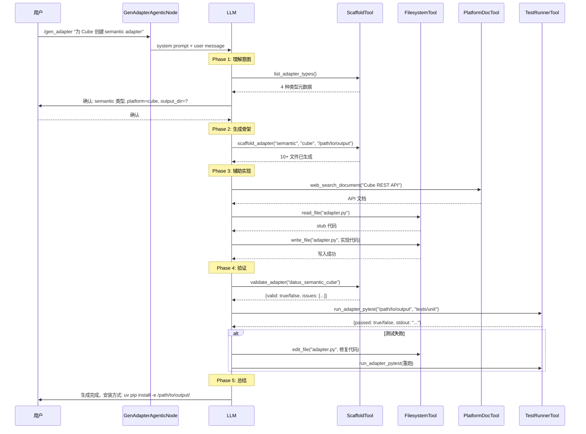

# gen_adapter 设计文档

## 概述

`gen_adapter` 是 Datus Agent 的一个内置 subagent，用于自动生成适配器（adapter）项目。它可以为外部平台（语义层、BI 工具、数据库、调度器）生成完整的 Python 包骨架，并通过 LLM 辅助实现平台特定的业务逻辑，最终通过合约测试验证正确性。

整个设计遵循 **scaffold -> implement -> validate -> test -> iterate** 的闭环流程。

---

## 架构总览

```
用户输入 (/gen_adapter "为 Cube 创建 semantic adapter")
         │
         ▼
┌─────────────────────────────────┐
│     GenAdapterAgenticNode       │  ← AgenticNode 子类
│  (datus/agent/node/             │
│   gen_adapter_agentic_node.py)  │
├─────────────────────────────────┤
│  System Prompt (fallback/模板)   │
│  execute_stream() 多轮对话循环   │
│  session 管理 + auto compact    │
└───────────┬─────────────────────┘
            │ 挂载工具
            ▼
┌──────────────────────────────────────────────────┐
│                   Tool 层                         │
├──────────────┬───────────┬───────────┬────────────┤
│ Scaffold     │ Filesystem│ PlatformDoc│ TestRunner │
│ Tool         │ Tool      │ SearchTool │ Tool       │
│              │           │            │            │
│ scaffold_    │ read_file │ web_search_│ run_adapter│
│ adapter      │ write_file│ document   │ _pytest    │
│ validate_    │ edit_file │ list_doc_  │            │
│ adapter      │ list_dir  │ nav        │            │
│ list_adapter_│ read_multi│ get_doc    │            │
│ types        │           │ search_doc │            │
└──────────────┴───────────┴───────────┴────────────┘
```

---

## 核心组件

### 1. GenAdapterAgenticNode（Subagent 节点）

**文件**: `datus/agent/node/gen_adapter_agentic_node.py`

继承自 `AgenticNode`，是 gen_adapter 的入口和编排层。

**关键设计**:

- **NODE_NAME** = `"gen_adapter"`，注册在 `NodeType.TYPE_GEN_ADAPTER` 和 `SYS_SUB_AGENTS` 中
- **执行模式**: `interactive`（CLI REPL 多轮对话）和 `workflow`（程序化单次调用）
- **最大轮次**: 默认 30，可通过 `agent.yml` 的 `agentic_nodes.gen_adapter.max_turns` 配置
- **输入/输出模型**: 复用 `SemanticNodeInput` / `SemanticNodeResult`（来自 `datus/schemas/semantic_agentic_node_models.py`）

**工具挂载顺序**:

```python
def setup_tools(self):
    self._setup_scaffold_tools()       # 1. 骨架生成 + 静态验证
    self._setup_filesystem_tools()     # 2. 文件读写编辑
    self._setup_platform_doc_tools()   # 3. 平台 API 文档搜索
    self._setup_test_runner_tool()     # 4. pytest 运行器
    if self.execution_mode == "interactive":
        self._setup_ask_user_tool()    # 5. 交互确认（仅 interactive 模式）
```

**System Prompt 策略**:

优先加载 Jinja2 模板 `gen_adapter_system_*.j2`（目前未创建），fallback 到内置 prompt。fallback prompt 包含：
- 角色定义（adapter generation assistant）
- 工具使用指引
- **安装提示**：生成完成后告知用户 `uv pip install -e <path>/`

**LangSmith 集成**:

调用 `generate_with_tools_stream()` 时传入 `agent_name=self.get_node_name()`，确保 trace 中显示 `gen_adapter` 而非默认的 `Tools_Agent`。

---

### 2. AdapterScaffoldTool（骨架生成工具）

**文件**: `datus/tools/func_tool/adapter_scaffold_tool.py`

核心工具类，提供 3 个 function tool：

#### 2.1 `list_adapter_types()`

列出支持的 4 种 adapter 类型及其元数据：

| 类型 | 基类 | 包名前缀 | entry-point group |
|------|------|----------|-------------------|
| `semantic` | `BaseSemanticAdapter` | `datus_semantic_{platform}` | `datus.semantic_adapters` |
| `bi` | `BIAdapterBase` | `datus_bi_{platform}` | `datus.bi_adapters` |
| `db` | `BaseSqlConnector` | `datus_{platform}` | `datus.adapters` |
| `scheduler` | `BaseSchedulerAdapter` | `datus_scheduler_{platform}` | `datus.schedulers` |

每种类型的抽象方法、导入路径、注册方式都定义在 `ADAPTER_TYPE_CONFIG` 字典中，是整个骨架生成的数据驱动核心。

#### 2.2 `scaffold_adapter(adapter_type, platform, output_dir, display_name)`

根据类型和平台名生成完整项目结构：

```
output_dir/
├── datus_semantic_{platform}/
│   ├── __init__.py          # register() 入口 + 导出
│   ├── adapter.py           # Adapter 类，包含所有抽象方法的 stub
│   ├── config.py            # Pydantic Config 类
│   └── py.typed             # PEP 561 类型标记
├── tests/
│   ├── conftest.py
│   └── unit/
│       ├── test_adapter.py  # 基本实例化测试
│       └── test_contract.py # 合约测试（仅 semantic 类型）
├── pyproject.toml           # 包元数据 + entry-point 注册
└── README.md
```

**模板生成器**（内部函数）:

| 函数 | 生成文件 | 说明 |
|------|----------|------|
| `_gen_init_py()` | `__init__.py` | 包含 `register()` 函数，按 adapter 类型使用不同的 registry |
| `_gen_adapter_py()` | `adapter.py` | Adapter 类定义，semantic 类型的方法为 `async`，其他为同步 |
| `_gen_config_py()` | `config.py` | Pydantic 配置类，semantic 继承 `SemanticAdapterConfig`，其他继承 `BaseModel` |
| `_gen_test_skeleton()` | `test_adapter.py` | 基本测试：实例化、register 可调用性 |
| `_gen_contract_test_py()` | `test_contract.py` | 合约测试，接入 `datus_semantic_core.testing` 的共享测试套件 |
| `_gen_pyproject_toml()` | `pyproject.toml` | 使用 hatchling 构建，注册 entry-point |
| `_gen_readme()` | `README.md` | 安装和使用说明 |

**设计亮点**:

- **数据驱动**: 所有 adapter 类型的差异都封装在 `ADAPTER_TYPE_CONFIG` 中，模板生成器通用
- **命名规范自动化**: `_to_pascal_case()` 确保类名、`_PACKAGE_PREFIX` / `_PROJECT_NAME` 确保包名和项目名符合规范
- **合约测试仅 semantic**: 因为只有 semantic adapter 有 `datus_semantic_core.testing` 提供的共享测试套件

#### 2.3 `validate_adapter(adapter_module_path)`

对生成的 adapter 进行静态验证：

1. **模块可导入** — `importlib.import_module()` 不报错
2. **`register()` 存在且可调用** — `getattr(mod, "register")`
3. **包含 Adapter 类** — 扫描模块中以 `Adapter` 结尾的类
4. **方法已实现** — 检查源码中是否还有 `NotImplementedError`

返回 `{"valid": bool, "issues": list[str]}`。

---

### 3. AdapterTestRunnerTool（测试运行器）

**文件**: `datus/tools/func_tool/adapter_test_runner_tool.py`

在生成的 adapter 项目内运行 pytest，使 LLM 能闭环：scaffold -> implement -> test -> fix -> re-test。

**安全约束**（由 `_validate_inputs()` 强制执行）:

| 约束 | 实现 |
|------|------|
| `project_dir` 必须是绝对路径 | `os.path.isabs()` 检查 |
| 必须包含 `pyproject.toml` | 只允许 scaffold 过的项目 |
| `test_subpath` 必须以 `tests/` 开头 | 防止运行任意目录 |
| 不允许 `..` 路径穿越 | 逐段检查 |
| 解析后路径不能越出 `project_dir` | `os.path.realpath()` + `startswith` |
| 固定 pytest 参数 | `-q --tb=short --no-header`，不接受自定义 flags |
| 硬超时 120 秒 | `subprocess.run(timeout=120)` |
| 输出截断 8KB | `_truncate_tail()` 保留尾部（pytest summary） |

**PYTHONPATH 注入**: 自动将 `project_dir` 加入 `PYTHONPATH`，这样即使没有 `pip install -e .`，生成的包也能被测试导入。

---

### 4. ADAPTER_SPEC.md（接口契约规范）

**文件**: `datus/tools/semantic_tools/ADAPTER_SPEC.md`

专为 LLM 消费设计的接口规范文档，定义了：

- **4 个必须实现的抽象方法**: `list_metrics`, `get_dimensions`, `query_metrics`, `validate_semantic`
- **2 个可选方法**: `list_semantic_models`, `get_semantic_model`
- 每个方法的参数、返回类型、字段说明、示例
- **配置类继承规范**: 继承 `SemanticAdapterConfig`
- **注册模式**: `register()` + entry-point
- **合约测试用法**: `make_semantic_contract_suite` 的使用方式
- **平台概念映射表**: Cube / Looker / dbt Semantic Layer 的对应关系

这个文件被 LLM 在实现阶段参考，指导它正确地将平台 API 映射到 Datus 标准接口。

---

## 注册与入口

### NodeType 注册

```python
# datus/configuration/node_type.py
TYPE_GEN_ADAPTER = "gen_adapter"
```

加入 `ACTION_TYPES` 列表和 `NODE_TYPE_DESCRIPTIONS` 字典，使用 `SemanticNodeInput` 作为输入模型。

### SYS_SUB_AGENTS 注册

```python
# datus/utils/constants.py
SYS_SUB_AGENTS = {
    ...,
    "gen_adapter",
}
```

这使得 `gen_adapter` 可以通过 CLI 的 `/gen_adapter` 命令调用。

### 配置

```yaml
# agent.yml
agent:
  agentic_nodes:
    gen_adapter:
      model: claude       # 可选
      max_turns: 30       # 可选
```

---

## 执行流程



---

## 合约测试设计

semantic adapter 的合约测试是整个闭环的关键。

### 共享测试套件

`datus_semantic_core.testing.make_semantic_contract_suite()` 提供了统一的合约测试：

| 测试 | 验证内容 |
|------|----------|
| `test_list_metrics_returns_list_of_metric_definition` | 返回 `list[MetricDefinition]`，dimensions 是 `list[str]` |
| `test_list_metrics_respects_limit` | `limit=1` 返回 ≤1 条 |
| `test_get_dimensions_returns_list_of_dimension_info` | 返回 `list[DimensionInfo]` |
| `test_query_metrics_returns_query_result` | 返回 `QueryResult` |
| `test_query_metrics_data_rows_are_dicts` | `.data` 的每行是 `dict`，不是 tuple/list |
| `test_query_metrics_dry_run_contract` | `dry_run=True` 时 metadata 含 `dry_run` 或列含 `sql` |
| `test_validate_semantic_returns_validation_result` | 返回 `ValidationResult` |

### factory() 模式

每个 adapter 的合约测试只需实现一个 `factory()` 函数：

```python
async def factory() -> CubeAdapter:
    config = CubeConfig(api_base_url="http://mock.local")
    adapter = CubeAdapter(config)
    adapter._http_get = AsyncMock(return_value=FIXTURE_META)
    return adapter
```

这种设计的好处：
- **共享断言**: 所有 semantic adapter 遵循相同的合约，避免各自写不同标准的测试
- **LLM 友好**: LLM 只需填充 factory，不需要理解断言逻辑
- **可扩展**: 新增合约只需修改 `datus_semantic_core.testing`，所有 adapter 自动覆盖

---

## 插件安装机制

生成的 adapter 通过 Python **entry-point** 机制注册为 Datus 插件：

```toml
# pyproject.toml
[project.entry-points."datus.semantic_adapters"]
cube = "datus_semantic_cube:register"
```

安装后，Datus 运行时通过 `importlib.metadata.entry_points()` 自动发现所有已注册的 adapter，调用其 `register()` 函数完成注册。

安装命令：
```bash
uv pip install -e <adapter_project_dir>/
```

- editable 模式（`-e`）允许修改代码后无需重新安装
- 卸载只需 `uv pip uninstall datus-semantic-cube`

---

## 与其他 subagent 的设计对比

| 维度 | gen_adapter | gen_semantic_model | gen_skill |
|------|-------------|-------------------|-----------|
| 输出物 | 独立 Python 包 | YAML 语义模型 | Skill 脚本 |
| 写入位置 | 用户指定的外部目录 | workspace 内 | skills 目录 |
| 文件系统工具 | 无 root_path 限制 | root = workspace | 双 root (workspace + skills) |
| 测试能力 | 内置 pytest runner | 无 | 无 |
| 验证方式 | 静态检查 + 合约测试 | LLM 自检 | LLM 自检 |
| 外部文档搜索 | PlatformDocSearchTool | 无 | 无 |

---

## 文件清单

| 组件 | 文件路径 |
|------|----------|
| Agentic Node | `datus/agent/node/gen_adapter_agentic_node.py` |
| Scaffold Tool | `datus/tools/func_tool/adapter_scaffold_tool.py` |
| Test Runner Tool | `datus/tools/func_tool/adapter_test_runner_tool.py` |
| 接口契约规范 | `datus/tools/semantic_tools/ADAPTER_SPEC.md` |
| NodeType 注册 | `datus/configuration/node_type.py` |
| 常量注册 | `datus/utils/constants.py` |
| 用户文档 (EN) | `docs/subagent/gen_adapter.md` |
| 用户文档 (ZH) | `docs/subagent/gen_adapter.zh.md` |
| 单元测试 | `tests/unit_tests/agent/node/test_gen_adapter_agentic_node.py` |
| 集成测试 | `tests/integration/agent/test_gen_adapter_agentic.py` |
| Scaffold 测试 | `tests/integration/tools/test_adapter_scaffold.py` |
